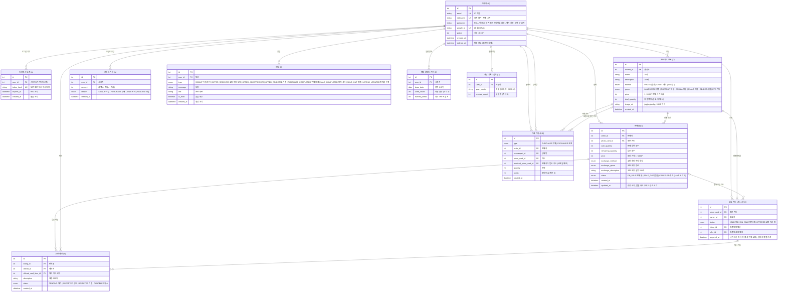

```mermaid
erDiagram
  users["사용자 (A)"] {
    int id PK
    string email UK "ID 역할"
    string nickname UK "중복 불가, 최대 10자"
    string password "NULL 허용 (구글 계정은 비밀번호 없음), 해시 저장, 입력 8~16자"
    string google_id UK "(심화) OAuth"
    int points "가입 시 10P"
    datetime created_at
    datetime deleted_at "탈퇴 여부 (소프트 삭제)"
  }

  refresh_tokens["리프레시 토큰 (A)"] {
    int id PK
    int user_id FK "사용자 (기기마다 1행)"
    string token_hash UK "토큰 원문 대신 해시 저장"
    datetime expires_at "만료 시각"
    datetime created_at "발급 시각"
  }

  photo_cards["포토카드 원본 (C)"] {
    int id PK
    int creator_id FK "생성자"
    string name "15자"
    string description "200자"
    enum method "PHOTO 촬영 | CRAFT 제작 | AI AI생성"
    enum genre "LANDSCAPE 풍경 | PORTRAIT 인물 | ANIMAL 동물 | PLANT 식물 | OBJECT 사물 | ETC 기타"
    int price "1~1000P, 판매 시 기본값"
    int total_quantity "총 발행량 (심화: 최대 10)"
    string image_url "jpg/png/webp, 10MB 이하"
    datetime created_at
  }

  card_items["보유 카드 1장=1행 (C)"] {
    int id PK
    int photo_card_id FK "원본 카드"
    int owner_id FK "소유자"
    enum status "HELD 보유 | ON_SALE 판매 중 | OFFERED 교환 제시 중"
    int listing_id FK "연결된 판매글"
    int offer_id FK "연결된 교환 제안"
    datetime acquired_at "내 카드가 된 시각 (생성·구매·교환), 갤러리 정렬 기준"
  }

  sale_listings["판매글 (D)"] {
    int id PK
    int seller_id FK "판매자"
    int photo_card_id FK "원본 카드"
    int sale_quantity "판매 등록 장수"
    int remaining_quantity "남은 장수"
    int price "장당 가격 1~1000P"
    enum exchange_method "교환 희망 제작 방식"
    enum exchange_genre "교환 희망 장르"
    string exchange_description "교환 희망 설명 200자"
    enum status "ON_SALE 판매 중 | SOLD_OUT 품절 | CANCELED 취소 (= 소프트 삭제)"
    datetime created_at
    datetime updated_at "수정 시각, 품절·취소 후에는 종료 시각"
  }

  exchange_offers["교환 제안 (E)"] {
    int id PK
    int listing_id FK "판매글"
    int offerer_id FK "제안자"
    int offered_card_item_id FK "제시 카드 1장"
    string description "내용 200자"
    enum status "PENDING 대기 | ACCEPTED 승인 | REJECTED 거절 | CANCELED 취소"
    datetime created_at
  }

  trades["거래 기록 (D·E)"] {
    int id PK
    enum type "PURCHASE 구매 | EXCHANGE 교환"
    int seller_id FK "판매자"
    int counterpart_id FK "상대방"
    int photo_card_id FK "카드"
    int received_photo_card_id FK "판매자가 받은 카드 (교환일 때만)"
    int quantity "수량"
    int points "포인트 (교환은 0)"
    datetime created_at
  }

  point_histories["포인트 기록 (A)"] {
    int id PK
    int user_id FK "사용자"
    int amount "금액 (+ 적립 / - 차감)"
    enum reason "SIGNUP 가입 | PURCHASE 구매 | SALE 판매 | RANDOM 랜덤"
    datetime created_at
  }

  notifications["알림 (B)"] {
    int id PK
    int user_id FK "대상"
    enum type "SIGNUP 가입 축하 | OFFER_RECEIVED 교환 제안 도착 | OFFER_ACCEPTED 승인 | OFFER_REJECTED 거절 | PURCHASE_COMPLETED 구매 완료 | SALE_COMPLETED 판매 성사 | SOLD_OUT 품절 | LISTING_UPDATED 판매글 수정"
    string message "내용"
    string link "관련 화면"
    boolean is_read "읽음 여부"
    datetime created_at "생성 시각"
  }

  random_point_logs["랜덤 포인트 기록 (E)"] {
    int id PK
    int user_id FK "사용자"
    date draw_date "날짜 (KST)"
    int used_count "사용 횟수 (최대 3)"
    int earned_points "획득 포인트 합계"
  }

  creation_logs["생성 기록 - 심화 (C)"] {
    int id PK
    int user_id FK "사용자"
    string year_month "연월 (KST, 예: 2026-10)"
    int created_count "생성 수 (최대 3)"
  }

  users ||--o{ refresh_tokens : "로그인 기기"
  users ||--o{ photo_cards : "생성"
  users ||--o{ card_items : "소유"
  photo_cards ||--|{ card_items : "발행량만큼"
  users ||--o{ sale_listings : "판매"
  photo_cards ||--o{ sale_listings : "판매 대상"
  sale_listings |o--o{ card_items : "판매 중인 카드"
  sale_listings ||--o{ exchange_offers : "받은 제안"
  users ||--o{ exchange_offers : "제안"
  card_items ||--o{ exchange_offers : "제시 카드"
  users ||--o{ trades : "판매자"
  users ||--o{ trades : "상대방"
  photo_cards ||--o{ trades : "거래 카드"
  photo_cards |o--o{ trades : "교환으로 받은 카드"
  users ||--o{ point_histories : "포인트 증감"
  users ||--o{ notifications : "알림"
  users ||--o{ random_point_logs : "일별 참여"
  users ||--o{ creation_logs : "월별 생성"

```
